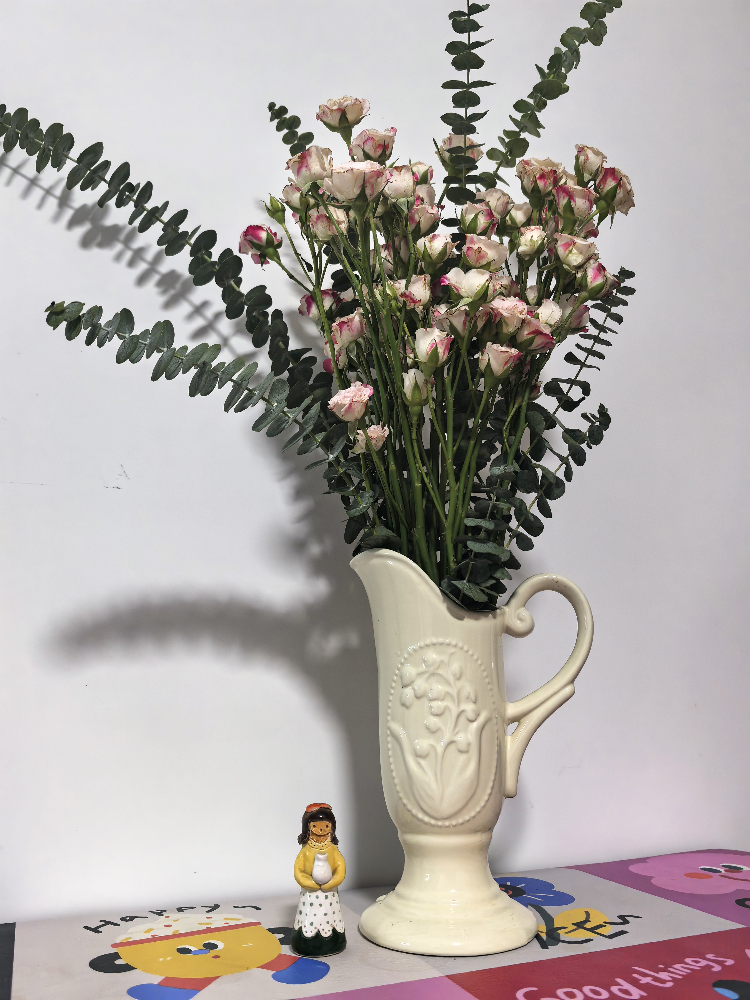
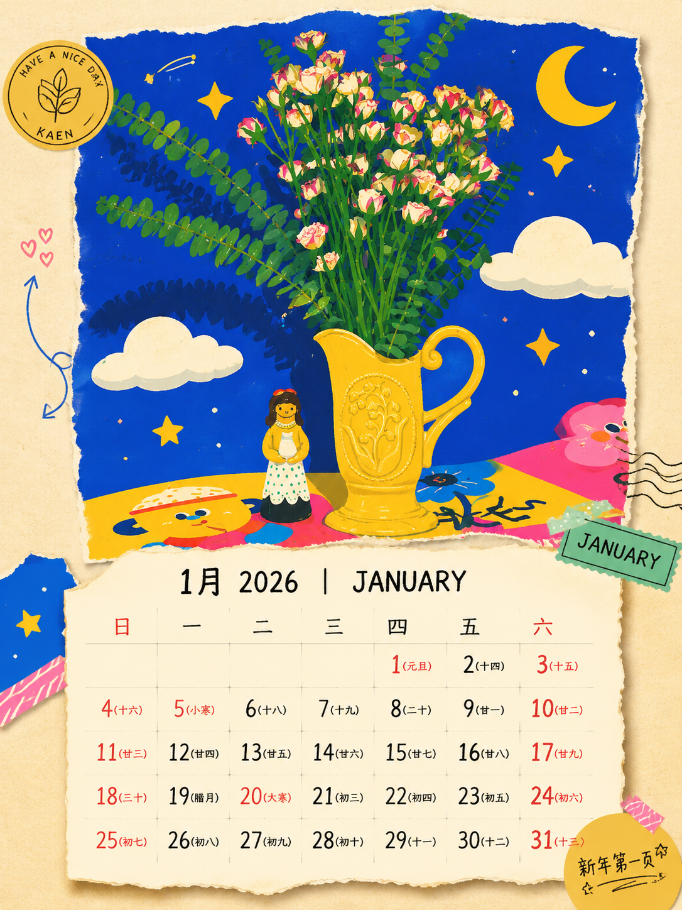
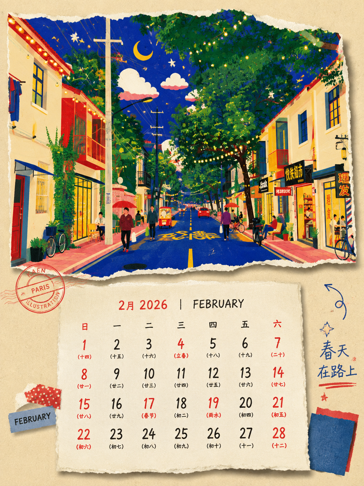
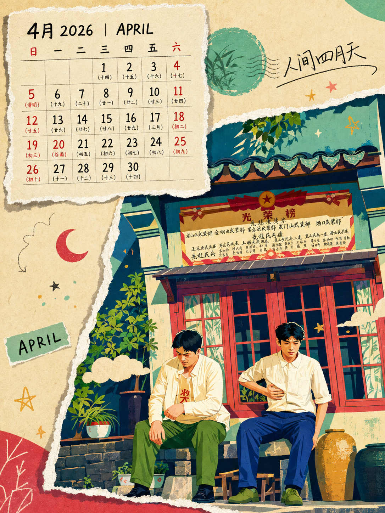
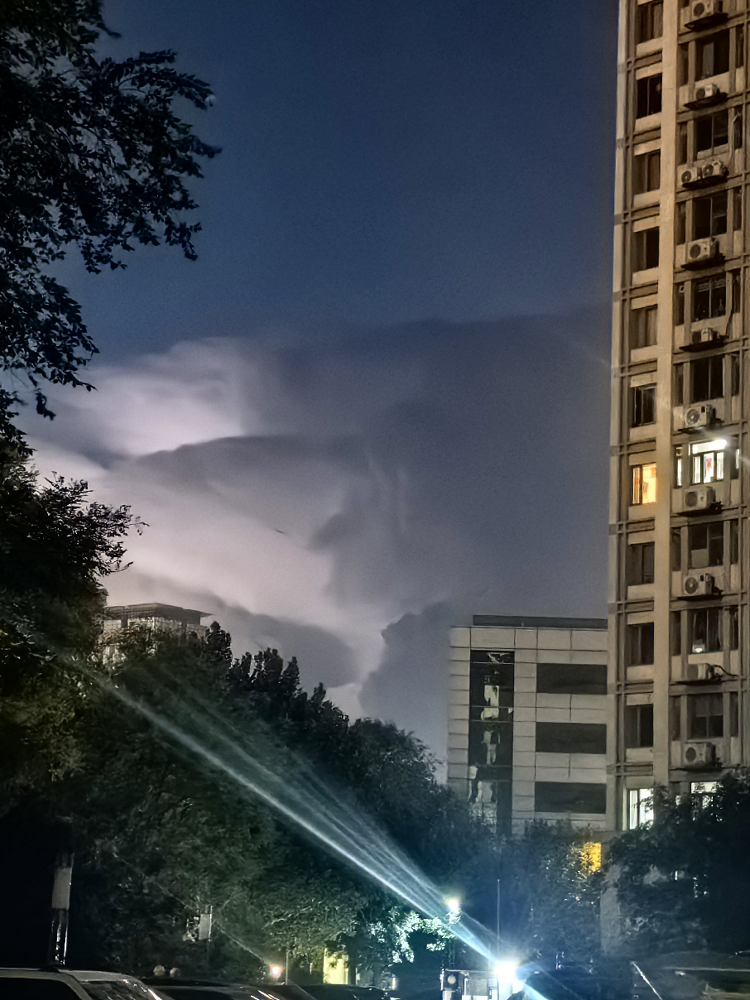
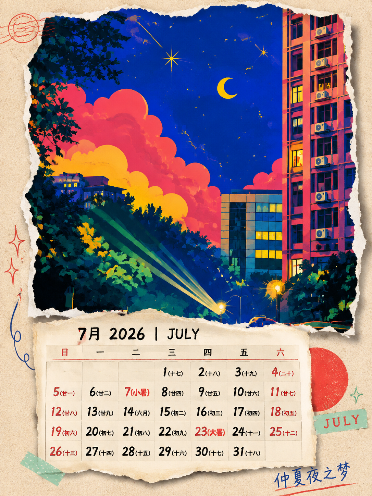
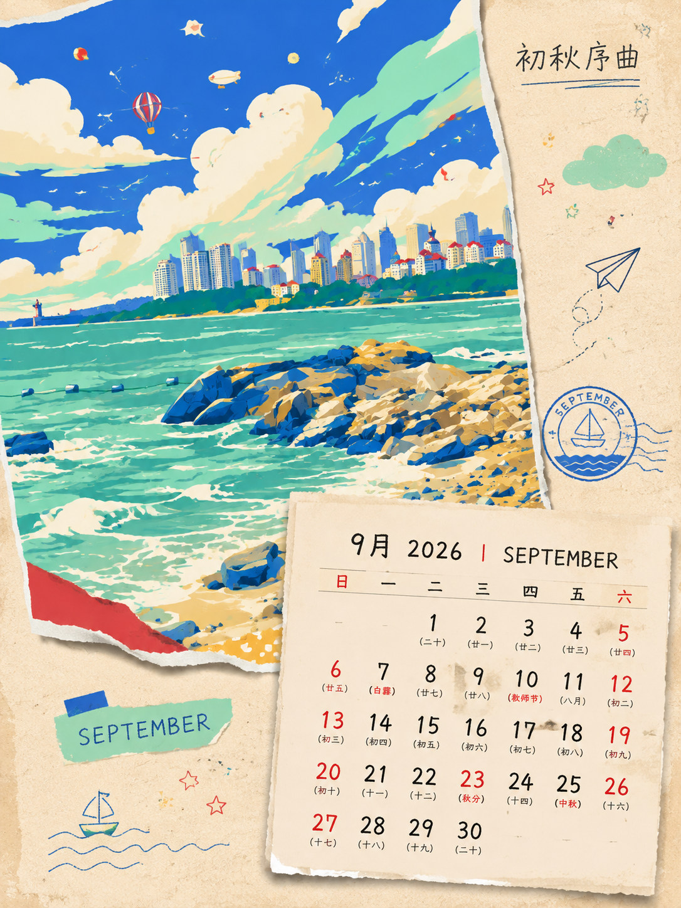
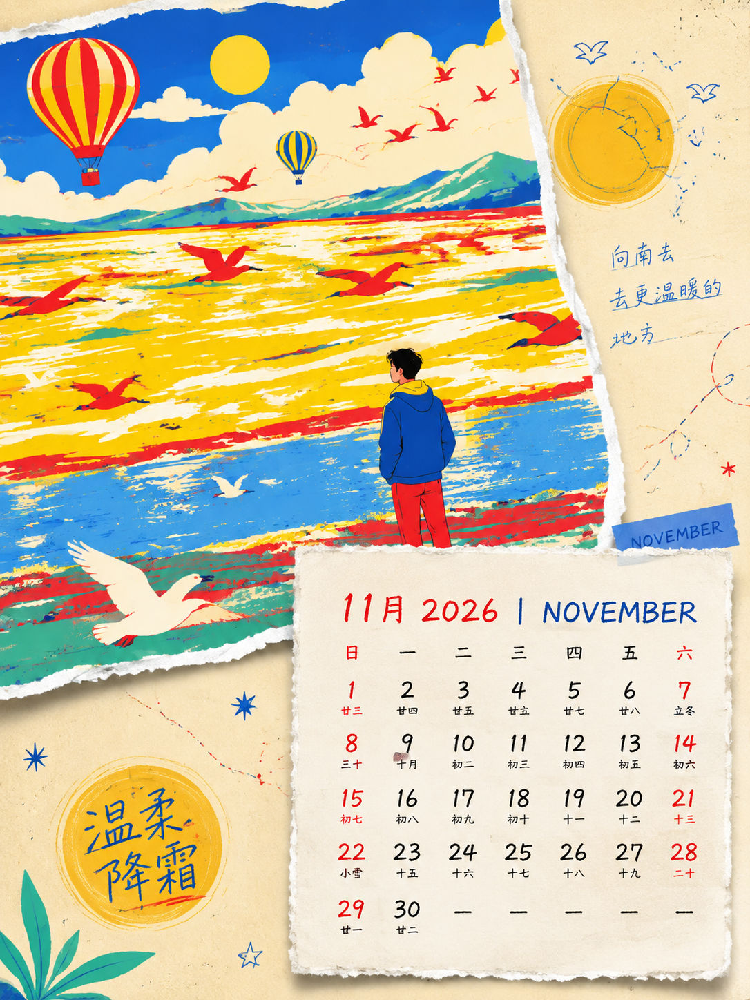

# Torn-Calendar 📅✂️

**撕纸风插画风日历 Skill** —— 把你的照片撕成一张日历：法国插画家 Kaen 风格的高饱和撞色插画，贴在做旧纸张上，再叠一张带农历、节气、节日的撕纸日历卡片。

Turn your photos into Kaen-style, candy-colored, torn-paper collage calendars — with Chinese lunar calendar, solar terms, and holidays baked in.

## 效果展示

2026 年 1~12 月全流程验证案例（原图 → 撕纸风插画风日历成品），左列为用户照片，右列为生成结果：

| 月份 | 原图 | 生成图 |
|---|---|---|
| 1 月 |  |  |
| 2 月 |  |  |
| 3 月 |  |  |
| 4 月 |  |  |
| 5 月 |  |  |
| 6 月 |  |  |
| 7 月 |  |  |
| 8 月 |  |  |
| 9 月 |  |  |
| 10 月 |  |  |
| 11 月 |  |  |
| 12 月 |  |  |

## 它能做什么

- 📷 **照片 → Kaen 插画**：人物/风景/城市整体转为高饱和撞色（钴蓝、樱桃红、蜂蜜黄、薄荷绿）扁平插画风，保留人物可辨识特征
- ✂️ **撕纸拼贴**：插画做成"撕下来的纸"，毛边、纤维丝、翘角、投影
- 🗓️ **真·可用日历**：公历 + 农历 + 24 节气 + 中外节日，周末红字，可圈纪念日
- 🔢 **灵活生成**：单月 / 连续多月 / 整年，任选年份
- 🤖 **多智能体可用**：标准 SKILL.md 格式，Claude Code、Codex、WorkBuddy 等均可加载

## 快速开始

### Claude Code

```bash
# 克隆到 skills 目录
git clone https://github.com/<你的用户名>/torn-calendar.git
mkdir -p ~/.claude/skills && mv torn-calendar ~/.claude/skills/

# 安装农历依赖
pip install lunardate
```

然后对 Claude 说：

> 帮我把这张照片做成 2026 年 3 月的撕纸风插画风日历，3 月 8 号圈出来

或整年：

> 用这张照片生成 2026 全年 12 张撕纸风日历

**零参数也行**——不上传照片、不指定时间，直接说：

> 给我来一张撕纸风日历

skill 会自动随机想象一个风景场景（不出现人物）并默认生成下个月的日历。

### 其他智能体（Codex / WorkBuddy 等）

- **WorkBuddy**：下载 [release/torn-calendar.zip](release/torn-calendar.zip)，在技能市场选择"上传技能"导入即可
- 或将本仓库作为上下文加载后，直接引用 `SKILL.md` 的工作流程；生图 prompt 模板在 [references/prompt-template.md](references/prompt-template.md)（面向 gpt-image-2，竖版 1024×1536）

## 仓库结构

```
├── SKILL.md                    # skill 主文件（工作流程）
├── references/
│   ├── style-guide.md          # Kaen × 撕纸 风格规范与色板
│   ├── prompt-template.md      # gpt-image-2 生图模板 + 修正话术
│   └── calendar-spec.md        # 日历排版规范 + 月份主题表
├── scripts/
│   └── calendar_gen.py         # 日历数据（公历/农历/节气/节日）
└── examples/                   # 效果示例
```

## 日历数据单独使用

```bash
python scripts/calendar_gen.py 2026 3      # 单月
python scripts/calendar_gen.py 2026 3-5    # 3~5月
python scripts/calendar_gen.py 2026 all    # 整年
python scripts/calendar_gen.py 2026 3 --no-lunar  # 无农历降级
```

## 已知限制

- 节气采用天文近似公式，个别年份可能偏差 1 天，重要日期请人工核对
- 生图模型的日历文字渲染可能出错，本 skill 已内置逐字校验与修正话术
- 风格受法国插画家 Kaen 启发，仅学习其色彩语言与画面氛围，不复制其具体作品

## License

MIT
